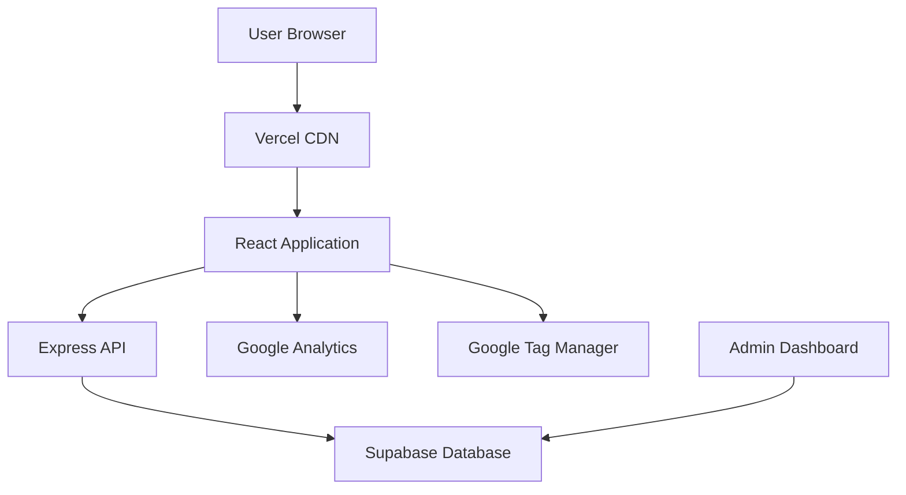
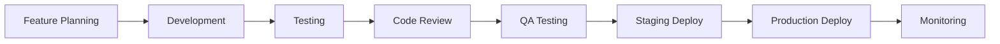

# NIVELA® Project Overview

## Executive Summary

The NIVELA® landing page is a cutting-edge web application designed to showcase and promote NIVELA®'s premium hair treatment technology. Built with modern React architecture, the platform delivers exceptional performance, comprehensive analytics, and optimized conversion funnels for professional hair stylists and distributors.

## Business Objectives

### Primary Goals
1. **Lead Generation**: Convert visitors into qualified leads for NIVELA® products
2. **Distributor Acquisition**: Recruit professional distributors across Brazil
3. **Brand Awareness**: Establish NIVELA® as a premium hair treatment brand
4. **Education**: Showcase ASTRO QUAT V3® technology benefits
5. **Conversion Optimization**: Maximize ROI through data-driven insights

### Success Metrics
- **Lead Conversion Rate**: Target 5-8% visitor-to-lead conversion
- **Distributor Sign-ups**: 50+ qualified distributors per month
- **Page Performance**: < 2.5s load time, 95+ Lighthouse score
- **User Engagement**: > 3 minutes average session duration
- **Mobile Experience**: 100% mobile-optimized experience

## Product Overview

### NIVELA® ASTRO QUAT V3® Technology
- **Formaldehyde-Free**: Safe, professional-grade hair treatment
- **30% Better Yield**: Superior results compared to traditional treatments
- **Amazon Rainforest Ingredients**: Natural, sustainable components
- **Professional Grade**: Designed for salon and professional use
- **International Quality**: Meets global safety and efficacy standards

### Target Audience

#### Primary: Professional Hair Stylists
- **Demographics**: 25-45 years, professional experience
- **Needs**: High-quality products, client satisfaction, business growth
- **Pain Points**: Product reliability, client retention, competitive pricing
- **Motivation**: Professional recognition, business success, client satisfaction

#### Secondary: Hair Care Distributors
- **Demographics**: 30-55 years, business experience
- **Needs**: Profitable products, market demand, reliable supplier
- **Pain Points**: Market competition, product differentiation, profitability
- **Motivation**: Business expansion, exclusive territories, profit margins

## Technical Architecture

### Technology Stack
```
Frontend:
├── React 18 (UI Framework)
├── TypeScript (Type Safety)
├── Tailwind CSS (Styling)
├── Vite (Build Tool)
├── Framer Motion (Animations)
└── shadcn/ui (Component Library)

Backend:
├── Node.js + Express (API Server)
├── Drizzle ORM (Database Layer)
├── PostgreSQL (Database)
└── Supabase (Database Hosting)

Analytics:
├── Google Analytics 4 (User Analytics)
├── Google Tag Manager (Event Tracking)
├── Core Web Vitals (Performance)
└── Custom Analytics (Business Metrics)

Deployment:
├── Vercel (Frontend Hosting)
├── Supabase (Database + Storage)
├── GitHub (Version Control)
└── CI/CD (Automated Deployment)
```

### System Architecture


## Key Features

### User-Facing Features

#### Landing Page Experience
- **Hero Section**: Compelling value proposition with video demonstration
- **Product Showcase**: Detailed ASTRO QUAT V3® technology explanation
- **Before/After Gallery**: Visual proof of product effectiveness
- **Testimonials**: Professional stylist endorsements
- **Technical Specifications**: Detailed product information
- **Call-to-Action**: Strategic placement for maximum conversion

#### Lead Generation Forms
- **Professional Lead Form**: Quick qualification for immediate follow-up
- **Distributor Registration**: Comprehensive form for business partnership
- **Contact Integration**: Direct WhatsApp connection with UTM tracking
- **Follow-up Automation**: Automated email sequences
- **CRM Integration**: Direct lead routing to sales team

#### Interactive Elements
- **Product Videos**: Lazy-loaded, engagement-tracked demonstrations
- **Image Galleries**: Optimized, responsive before/after showcases
- **Technical Calculators**: ROI and usage calculators for professionals
- **Download Resources**: PDF guides, technical specifications
- **Social Proof**: Real-time testimonials and usage statistics

### Technical Features

#### Performance Optimization
- **Bundle Size**: 207KB gzipped (highly optimized)
- **Load Time**: < 1.5s first load, < 0.5s subsequent loads
- **Core Web Vitals**: LCP < 2.5s, FID < 100ms, CLS < 0.1
- **Mobile Performance**: 95+ Lighthouse mobile score
- **Offline Capability**: Service worker for offline browsing

#### Analytics & Tracking
- **UTM Attribution**: Complete campaign tracking and attribution
- **Event Tracking**: Form submissions, video engagement, button clicks
- **Performance Monitoring**: Real-time Core Web Vitals tracking
- **Error Tracking**: Comprehensive error monitoring and alerting
- **Custom Metrics**: Business-specific KPI tracking

#### Security & Compliance
- **Data Protection**: LGPD-compliant data handling
- **Form Security**: Input validation and sanitization
- **Content Security Policy**: XSS and injection protection
- **SSL/TLS**: End-to-end encryption
- **API Security**: Rate limiting and abuse prevention

## Development Workflow

### Development Process


### Quality Assurance
- **Code Review**: Mandatory peer review for all changes
- **Automated Testing**: Unit, integration, and E2E test coverage
- **Performance Testing**: Lighthouse CI, bundle analysis
- **Accessibility Testing**: WCAG 2.1 AA compliance verification
- **Cross-browser Testing**: Chrome, Firefox, Safari, Edge
- **Mobile Testing**: iOS Safari, Chrome Mobile, Samsung Internet

### Deployment Pipeline
```bash
# Development workflow
1. Feature development on feature branch
2. Automated testing and linting
3. Pull request with code review
4. Merge to main branch
5. Automated deployment to staging
6. QA validation on staging
7. Production deployment
8. Post-deployment monitoring
```

## Business Impact

### Conversion Optimization

#### A/B Testing Framework
- **Form Variations**: Test different field configurations
- **CTA Optimization**: Button text, color, placement testing
- **Content Testing**: Headlines, value propositions, testimonials
- **Layout Testing**: Page structure and component ordering
- **Mobile Optimization**: Touch targets, scroll behavior, form UX

#### Analytics-Driven Decisions
- **Funnel Analysis**: Identify conversion bottlenecks
- **User Journey Mapping**: Optimize path to conversion
- **Performance Impact**: Correlate speed with conversion rates
- **Content Effectiveness**: Track engagement with different sections
- **Campaign Attribution**: ROI analysis by traffic source

### ROI Measurement

#### Key Performance Indicators
```typescript
interface BusinessMetrics {
  // Lead Generation
  leadConversionRate: number;        // Target: 5-8%
  costPerLead: number;               // Target: < R$ 50
  leadToCustomerRate: number;        // Target: 15-25%
  
  // Distributor Acquisition
  distributorSignups: number;        // Target: 50/month
  distributorActivation: number;     // Target: 80%
  distributorRetention: number;      // Target: 90% at 6 months
  
  // Performance
  pageLoadTime: number;              // Target: < 2.5s
  bounceRate: number;                // Target: < 40%
  sessionDuration: number;           // Target: > 3 minutes
  
  // Revenue Impact
  monthlyRevenue: number;            // Generated through platform
  customerLifetimeValue: number;     // Average customer value
  returnOnAdSpend: number;           // Target: > 300%
}
```

#### Business Intelligence Dashboard
- **Real-time Metrics**: Live conversion tracking
- **Campaign Performance**: UTM-based ROI analysis
- **User Behavior**: Heat maps, scroll tracking, form abandonment
- **Technical Performance**: Uptime, speed, error rates
- **Competitive Analysis**: Market positioning and benchmarking

## Risk Management

### Technical Risks

#### Performance Degradation
- **Monitoring**: Real-time performance alerts
- **Mitigation**: Performance budgets, automated testing
- **Response**: Rollback procedures, performance optimization

#### Security Vulnerabilities
- **Prevention**: Regular security audits, dependency updates
- **Detection**: Automated vulnerability scanning
- **Response**: Incident response plan, security patches

#### Service Outages
- **Prevention**: High availability architecture, redundancy
- **Detection**: Uptime monitoring, health checks
- **Response**: Automatic failover, emergency procedures

### Business Risks

#### Low Conversion Rates
- **Monitoring**: Real-time conversion tracking
- **Analysis**: User behavior analysis, A/B testing
- **Response**: UX optimization, content improvement

#### Competition
- **Monitoring**: Competitive analysis, market research
- **Response**: Feature differentiation, value proposition enhancement

#### Regulatory Changes
- **Monitoring**: Legal compliance tracking
- **Response**: Privacy policy updates, technical adjustments

## Future Roadmap

### Phase 2 Enhancements (Q4 2025)
- **Personalization Engine**: Dynamic content based on user behavior
- **Advanced Analytics**: Custom dashboard for distributors
- **Mobile App**: Progressive Web App capabilities
- **Multi-language Support**: Portuguese, Spanish, English
- **AI Chatbot**: Automated customer support and qualification

### Phase 3 Expansion (Q1 2026)
- **E-commerce Integration**: Direct product sales
- **Training Platform**: Educational content for professionals
- **Community Features**: Professional network and forums
- **Advanced CRM**: Integrated sales and marketing automation
- **International Expansion**: Multi-country, multi-currency support

### Long-term Vision (2026+)
- **Platform Ecosystem**: Complete professional hair care platform
- **API Marketplace**: Third-party integrations and partnerships
- **Data Intelligence**: Predictive analytics and market insights
- **Global Presence**: International brand recognition
- **Innovation Hub**: R&D platform for new product development

## Success Metrics & KPIs

### Technical Excellence
- **Performance Score**: 95+ Lighthouse score maintained
- **Uptime**: 99.9% availability
- **Security**: Zero critical vulnerabilities
- **User Experience**: < 2% error rate

### Business Impact
- **Lead Quality**: 70%+ qualified leads
- **Conversion Rate**: 6%+ visitor-to-lead conversion
- **Customer Satisfaction**: 4.8+ star rating
- **Market Share**: 15%+ in target segments

### Growth Metrics
- **Traffic Growth**: 25% month-over-month
- **Revenue Growth**: 40% quarter-over-quarter
- **Market Expansion**: 5+ new regions per quarter
- **Partner Network**: 200+ active distributors

---

This comprehensive project overview establishes NIVELA® as a premium, technology-driven brand with a robust digital platform designed for sustainable growth and market leadership in the professional hair care industry.