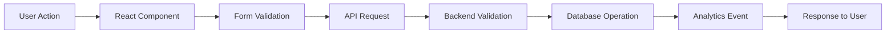
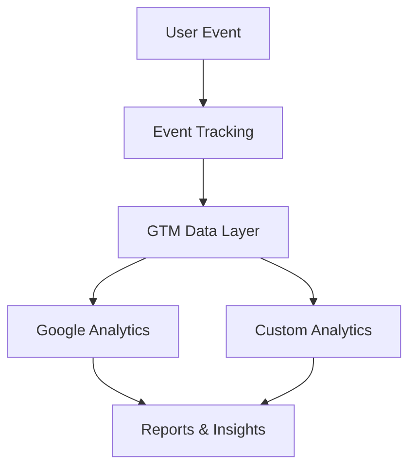
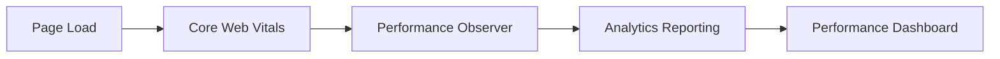

# NIVELA® Technical Architecture

## Overview

The NIVELA® landing page is built as a modern full-stack web application using React and TypeScript. The architecture prioritizes performance, maintainability, and analytics-driven insights for business optimization.

## Architecture Principles

### 1. Frontend-First Architecture
- **Principle:** Maximum functionality in the frontend, minimal backend dependencies
- **Implementation:** React SPA with server-side rendering capabilities
- **Benefits:** Better user experience, reduced server load, easier deployment

### 2. Type-Safe Development
- **Principle:** End-to-end type safety from database to UI
- **Implementation:** TypeScript + Drizzle ORM + Zod validation
- **Benefits:** Reduced runtime errors, better developer experience, easier refactoring

### 3. Performance-Driven Design
- **Principle:** Sub-2-second load times, excellent Core Web Vitals
- **Implementation:** Code splitting, lazy loading, optimized bundles
- **Benefits:** Better SEO, improved conversion rates, enhanced UX

### 4. Analytics-Centric Approach
- **Principle:** Every user interaction is measurable and actionable
- **Implementation:** GTM/GA4 integration with custom event tracking
- **Benefits:** Data-driven optimization, campaign attribution, ROI measurement

## System Components

### Frontend Stack

#### React 18 Application
```typescript
// Component architecture example
interface ComponentProps {
  data: TypedData;
  onAction: (event: AnalyticsEvent) => void;
}

const OptimizedComponent: React.FC<ComponentProps> = ({ data, onAction }) => {
  // Performance-optimized rendering
  // Analytics integration
  // Accessibility compliance
};
```

**Key Features:**
- **Concurrent Features:** Automatic batching, suspense boundaries
- **Performance:** React.memo, useMemo, useCallback optimizations
- **State Management:** React Query for server state, Context for global state
- **Error Boundaries:** Graceful error handling with analytics reporting

#### Styling System (Tailwind CSS)
```css
/* Custom design tokens */
:root {
  --brand-deep: #2D1B0E;
  --brand-caramel: #8B4513;
  --brand-latte: #D2B48C;
  --brand-light: #F5F5DC;
  --brand-accent: #DAA520;
}

/* Responsive breakpoints */
.container {
  @apply max-w-7xl mx-auto px-4 sm:px-6 lg:px-8;
}
```

**Design System Features:**
- **Atomic Design:** Components built from design tokens
- **Responsive Design:** Mobile-first approach
- **Dark Mode Ready:** CSS variables for theme switching
- **Accessibility:** Focus states, color contrast compliance

#### Component Library (shadcn/ui)
```typescript
// Form component with validation
import { useForm } from "react-hook-form";
import { zodResolver } from "@hookform/resolvers/zod";
import { insertLeadSchema } from "@shared/schema";

const LeadForm = () => {
  const form = useForm({
    resolver: zodResolver(insertLeadSchema),
    defaultValues: { nome: "", email: "", telefone: "" }
  });
  
  // Form submission with analytics tracking
};
```

### Backend Stack

#### Express.js API Layer
```typescript
// API route with validation
app.post("/api/leads", async (req, res) => {
  try {
    const leadData = insertLeadNivelaSchema.parse(req.body);
    const lead = await storage.createLeadNivela(leadData);
    
    // Analytics event
    trackEvent('lead_generated', { source: 'landing_page' });
    
    res.status(201).json({ success: true, lead });
  } catch (error) {
    handleApiError(error, res);
  }
});
```

**Features:**
- **Validation:** Zod schema validation on all endpoints
- **Error Handling:** Structured error responses with logging
- **Security:** CORS, rate limiting, input sanitization
- **Analytics:** Request tracking and performance monitoring

#### Database Layer (Drizzle ORM)
```typescript
// Type-safe database schema
export const leadsNivela = pgTable("leads_nivela", {
  id: uuid("id").primaryKey().defaultRandom(),
  nome: text("nome").notNull(),
  email: text("email").notNull().unique(),
  telefone: text("telefone").notNull(),
  tipoEstabelecimento: text("tipo_estabelecimento"),
  // UTM tracking fields
  utmSource: text("utm_source"),
  utmMedium: text("utm_medium"),
  utmCampaign: text("utm_campaign"),
  // Audit fields
  createdAt: timestamp("created_at").defaultNow(),
});

// Type-safe operations
const insertLeadSchema = createInsertSchema(leadsNivela);
type InsertLead = z.infer<typeof insertLeadSchema>;
```

**Benefits:**
- **Type Safety:** Full TypeScript integration
- **Migration Management:** Version-controlled schema changes
- **Query Builder:** SQL-like syntax with type checking
- **Performance:** Optimized queries with connection pooling

### Data Flow Architecture

#### 1. User Interaction Flow


#### 2. Analytics Data Flow


#### 3. Performance Monitoring Flow


## Performance Architecture

### Bundle Optimization Strategy

#### Code Splitting
```typescript
// Route-based code splitting
const LazyComponent = lazy(() => import('./HeavyComponent'));

// Component wrapping with Suspense
<Suspense fallback={<LoadingSpinner />}>
  <LazyComponent />
</Suspense>
```

#### Asset Optimization
```typescript
// Image optimization
const OptimizedImage = ({ src, alt, ...props }) => (
  
);

// Video lazy loading
const VideoLazy = ({ src, thumbnail }) => {
  const [shouldLoad, setShouldLoad] = useState(false);
  
  useIntersectionObserver(() => setShouldLoad(true));
  
  return shouldLoad ? <video src={src} /> : ;
};
```

### Caching Strategy

#### Browser Caching
```typescript
// Service Worker caching
const cachingStrategy = {
  static: 'cache-first',     // CSS, JS, Images
  api: 'network-first',      // API responses
  html: 'stale-while-revalidate'  // Page content
};
```

#### CDN Integration
- **Supabase Storage:** Optimized asset delivery
- **Vercel Edge:** Global content distribution
- **Browser Cache:** Long-term static asset caching

## Analytics Architecture

### Google Tag Manager Integration

#### Data Layer Structure
```typescript
interface DataLayerEvent {
  event: string;
  event_category?: string;
  event_action?: string;
  event_label?: string;
  value?: number;
  custom_parameters?: Record<string, any>;
}

// Event tracking example
const trackFormSubmission = (formType: string, success: boolean) => {
  window.dataLayer?.push({
    event: 'form_submission',
    event_category: 'engagement',
    event_action: formType,
    event_label: success ? 'success' : 'error',
    form_type: formType,
    success_status: success
  });
};
```

#### Performance Metrics Tracking
```typescript
// Core Web Vitals monitoring
const trackWebVitals = () => {
  new PerformanceObserver((list) => {
    list.getEntries().forEach((entry) => {
      const metricName = entry.entryType;
      const metricValue = entry.startTime || entry.value;
      
      gtag('event', metricName, {
        value: Math.round(metricValue),
        non_interaction: true
      });
    });
  }).observe({ entryTypes: ['largest-contentful-paint', 'first-input', 'layout-shift'] });
};
```

### UTM Campaign Attribution

#### UTM Persistence Strategy
```typescript
// UTM capture and storage
const captureUTMParams = () => {
  const urlParams = new URLSearchParams(window.location.search);
  const utmData = {
    utm_source: urlParams.get('utm_source'),
    utm_medium: urlParams.get('utm_medium'),
    utm_campaign: urlParams.get('utm_campaign'),
    utm_content: urlParams.get('utm_content'),
    utm_term: urlParams.get('utm_term')
  };
  
  // Store in sessionStorage for session persistence
  sessionStorage.setItem('nivela_utms', JSON.stringify(utmData));
  
  return utmData;
};

// UTM injection into form submissions
const submitWithAttribution = async (formData) => {
  const utmData = JSON.parse(sessionStorage.getItem('nivela_utms') || '{}');
  
  const payload = {
    ...formData,
    ...utmData,
    attribution_timestamp: new Date().toISOString()
  };
  
  return await submitForm(payload);
};
```

## Security Architecture

### Input Validation
```typescript
// Multi-layer validation
const validateInput = (data: unknown) => {
  // 1. Zod schema validation
  const validatedData = schema.parse(data);
  
  // 2. Business rule validation
  if (!isValidBusinessEmail(validatedData.email)) {
    throw new ValidationError('Invalid business email');
  }
  
  // 3. Sanitization
  return sanitizeInput(validatedData);
};
```

### Content Security Policy
```html
<!-- CSP Headers -->
<meta http-equiv="Content-Security-Policy" 
      content="default-src 'self'; 
               script-src 'self' 'unsafe-inline' *.googletagmanager.com *.google-analytics.com;
               style-src 'self' 'unsafe-inline' fonts.googleapis.com;
               img-src 'self' data: *.supabase.co *.google-analytics.com;
               connect-src 'self' *.supabase.co *.google-analytics.com;">
```

### Environment Security
```typescript
// Environment variable validation
const requiredEnvVars = [
  'DATABASE_URL',
  'VITE_SUPABASE_URL',
  'VITE_SUPABASE_ANON_KEY'
];

requiredEnvVars.forEach(envVar => {
  if (!process.env[envVar]) {
    throw new Error(`Missing required environment variable: ${envVar}`);
  }
});
```

## Deployment Architecture

### Build Process
```typescript
// Vite build configuration
export default defineConfig({
  build: {
    rollupOptions: {
      output: {
        manualChunks: {
          vendor: ['react', 'react-dom'],
          analytics: ['@analytics/google-analytics'],
          ui: ['@radix-ui/react-dialog', '@radix-ui/react-form']
        }
      }
    },
    target: 'es2020',
    sourcemap: false,
    minify: 'terser'
  }
});
```

### Environment Configuration
```yaml
# Production deployment (Vercel)
production:
  framework: vite
  build_command: npm run build
  output_directory: client/dist
  environment_variables:
    - DATABASE_URL
    - VITE_SUPABASE_URL
    - VITE_SUPABASE_ANON_KEY
```

### Monitoring & Observability
```typescript
// Application monitoring
const monitoringSetup = {
  performance: {
    core_web_vitals: true,
    custom_metrics: true,
    real_user_monitoring: true
  },
  errors: {
    javascript_exceptions: true,
    api_errors: true,
    network_failures: true
  },
  analytics: {
    user_behavior: true,
    conversion_tracking: true,
    campaign_attribution: true
  }
};
```

## Future Architecture Considerations

### Scalability Enhancements
1. **Database Optimization:** Query optimization, indexing strategy
2. **Caching Layer:** Redis for session storage and API caching
3. **CDN Strategy:** Multi-region content distribution
4. **API Rate Limiting:** Protection against abuse and DOS

### Feature Expansion
1. **A/B Testing Framework:** Experimentation platform integration
2. **Personalization Engine:** Dynamic content based on user behavior
3. **Advanced Analytics:** Custom dashboard and reporting
4. **Multi-language Support:** Internationalization infrastructure

### Technology Evolution
1. **React Server Components:** Enhanced performance and SEO
2. **Edge Computing:** Closer data processing to users
3. **Progressive Web App:** Enhanced mobile experience
4. **Advanced AI Integration:** Chatbot and recommendation systems

---

This technical architecture provides a solid foundation for the NIVELA® landing page while maintaining flexibility for future enhancements and scalability requirements.